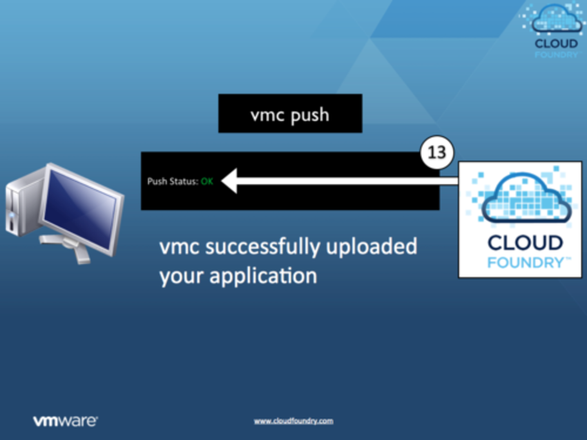

!SLIDE

#What Happens When You vmc push an Application to Cloud Foundry#

!SLIDE  center

!SLIDE  center

!SLIDE  center

!SLIDE  center

!SLIDE  center

!SLIDE  center

!SLIDE  center

!SLIDE  center

!SLIDE  center

!SLIDE  center

!SLIDE  center

!SLIDE  center

!SLIDE  center

!SLIDE  center

!SLIDE  center

!SLIDE  center

!SLIDE  center

!SLIDE  center

!SLIDE
http://blog.cloudfoundry.com/post/4737632136/what-happens-when-you-vmc-push-an-application-to-cloud-foundry