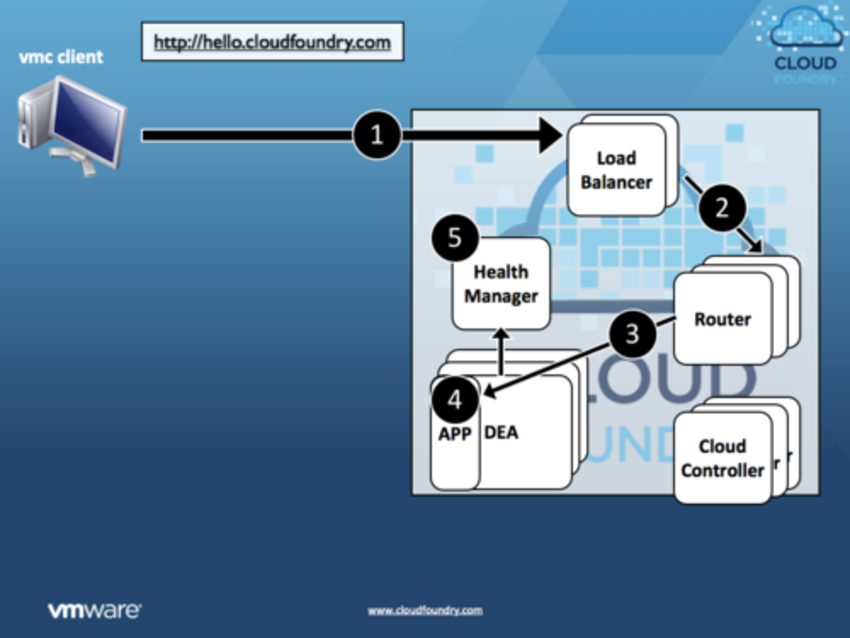

!SLIDE

#How Cloud Foundry Works When a New Application is Deployed#

!SLIDE  center

!SLIDE  center

!SLIDE  center

!SLIDE  center

!SLIDE  center

!SLIDE  center

!SLIDE  center

!SLIDE  center

!SLIDE  center

!SLIDE  center

!SLIDE  center

!SLIDE  center

!SLIDE
http://blog.cloudfoundry.com/post/5223861703/how-cloud-foundry-works-when-a-new-application-is-deployed